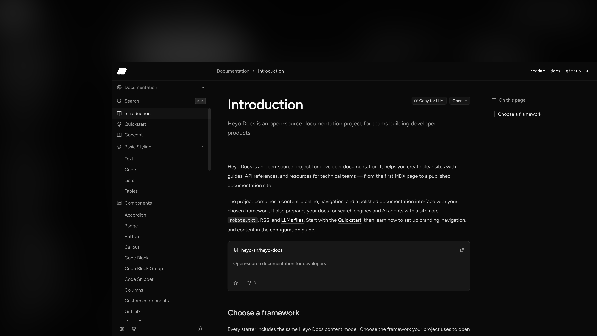

## Heyo Docs

Heyo Docs is a themeable documentation toolkit for React Router, Next.js, and Astro. Create a standalone documentation site with MDX content, navigation, search, OpenAPI reference pages, and built-in SEO.

[Documentation](https://docs.heyo.sh) · [GitHub](https://github.com/heyo-sh/heyo-docs)

## Get started

Create a new documentation project, then start its development server:

```bash
pnpm create @heyo-sh/heyo-docs my-docs
cd my-docs
pnpm dev
```

The creator lets you choose React Router, Next.js, or Astro, as well as a theme and deployment target. It also works with Bun, npm, and Yarn:

```bash
bun create @heyo-sh/heyo-docs my-docs
npm create @heyo-sh/heyo-docs@latest my-docs
yarn create @heyo-sh/heyo-docs my-docs
```

For an existing application, follow the framework-specific guides for [React Router](https://docs.heyo.sh/framework/react-router), [Next.js](https://docs.heyo.sh/framework/nextjs), or [Astro](https://docs.heyo.sh/framework/astro).

## Minimum Configuration

`heyo-docs.config.ts` is the single source of truth for your site's content, navigation, appearance, and metadata. Only `content` is required:

```ts
import { heyoDocs } from "@heyo-sh/heyo-docs";

export default heyoDocs({
  title: "Acme Docs",
  description: "Guides and API reference for Acme.",
  content: "content",
  theme: "grain",
  siteUrl: "https://docs.acme.com",
  branding: { name: "Acme", logo: "/logo.svg" },
  groups: [
    {
      group: "Documentation",
      sections: [
        {
          section: "Get started",
          pages: ["index", "quickstart"],
        },
      ],
    },
  ],
});
```

| Option                             | Purpose                                                                   |
| ---------------------------------- | ------------------------------------------------------------------------- |
| `content`                          | Required directory containing your MDX files and local OpenAPI documents. |
| `title`, `description`, `branding` | Site identity and default metadata.                                       |
| `groups`                           | Sidebar structure and page order.                                         |
| `theme`, `mode`, `colors`          | Built-in theme and visual preferences.                                    |
| `siteUrl`                          | Public canonical URL for SEO, RSS, sitemap, and AI discovery files.       |
| `footer`, `navigation`             | Optional footer links and application-owned header UI.                    |

Read the [configuration guide](https://docs.heyo.sh/manage-website/configuration) for the complete reference, then add pages under `content/`. Built-in MDX components, OpenAPI, deployment, and styling guides live in the [documentation](https://docs.heyo.sh).

## Contributing

See [CONTRIBUTING.md](CONTRIBUTING.md) for local development and contribution guidelines.

## License

[MIT](LICENSE)
