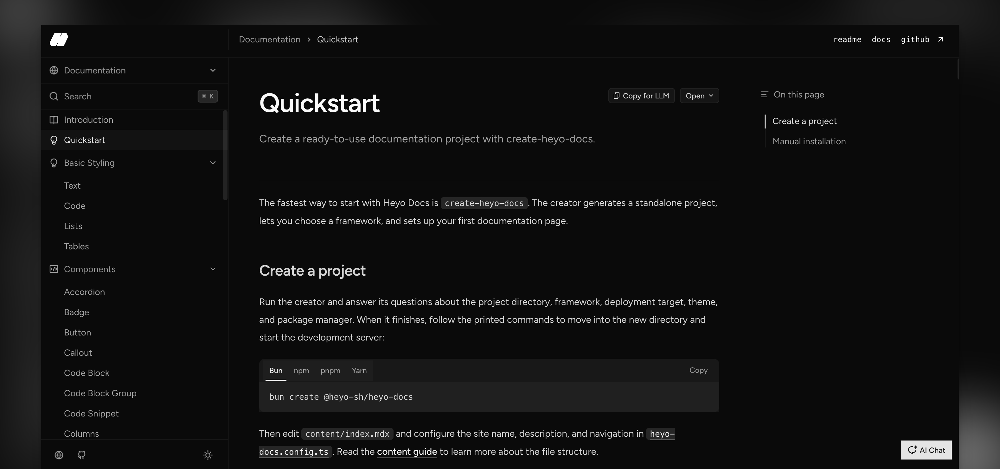

<div align="center">
  

  <h1>Heyo Docs</h1>

  <p>
    A themeable documentation toolkit for React Router, Next.js, and Astro.
    Create a standalone documentation site with MDX content, navigation, search,
    OpenAPI reference pages, and built-in SEO.
  </p>

  <p>
    <a href="https://npmjs.com/package/@heyo-sh/heyo-docs"></a>
    <a href="https://www.npmjs.com/package/@heyo-sh/heyo-docs"></a>
    <a href="https://github.com/heyo-sh/heyo-docs/stargazers"></a>
    
    
  </p>

  <p>
    <a href="https://docs.heyo.sh/introduction/">Documentation</a>
    ·
    <a href="https://docs.heyo.sh/changelog">Changelog (Demo)</a>
    ·
    <a href="https://docs.heyo.sh/api-demo/overview">OpenAPI (Demo)</a>
  </p>
</div>

## Get started

Start the creator and answer its questions about the project directory,
framework, deployment target, theme, and package manager. When it finishes, it
prints the exact commands for starting the development server.

```bash
# pnpm
pnpm create @heyo-sh/heyo-docs

# npm
npm create @heyo-sh/heyo-docs@latest

# Yarn
yarn dlx @heyo-sh/create-heyo-docs

# Bun
bun create @heyo-sh/heyo-docs
```

The creator works with pnpm, npm, Yarn, and Bun. It lets you choose React
Router, Next.js, or Astro, plus a theme and deployment target.

For an existing application, follow the framework-specific guides for [React Router](https://docs.heyo.sh/framework/react-router), [Next.js](https://docs.heyo.sh/framework/nextjs), or [Astro](https://docs.heyo.sh/framework/astro).

## Minimum Configuration

`heyo-docs.config.ts` is the single source of truth for your site's content, navigation, appearance, and metadata. Only `content` is required:

```ts
import { heyoDocs } from "@heyo-sh/heyo-docs";

export default heyoDocs({
  title: "Acme Docs",
  description: "Guides and API reference for Acme.",
  content: "content",
  theme: "grain",
  siteUrl: "https://docs.acme.com",
  branding: { name: "Acme", logo: "/logo.svg" },
  groups: [
    {
      group: "Documentation",
      sections: [
        {
          section: "Get started",
          pages: ["index", "quickstart"],
        },
      ],
    },
  ],
});
```

| Option                             | Purpose                                                                   |
| ---------------------------------- | ------------------------------------------------------------------------- |
| `content`                          | Required directory containing your MDX files and local OpenAPI documents. |
| `title`, `description`, `branding` | Site identity and default metadata.                                       |
| `groups`                           | Sidebar structure and page order.                                         |
| `theme`, `mode`, `colors`          | Built-in theme and visual preferences.                                    |
| `siteUrl`                          | Public canonical URL for SEO, RSS, sitemap, and AI discovery files.       |
| `footer`, `navigation`             | Optional footer links and application-owned header UI.                    |

Read the [configuration guide](https://docs.heyo.sh/manage-website/configuration) for the complete reference, then add pages under `content/`. Built-in MDX components, OpenAPI, deployment, and styling guides live in the [documentation](https://docs.heyo.sh).

## Contributing

See [CONTRIBUTING.md](CONTRIBUTING.md) for local development and contribution guidelines.

## License

[MIT](LICENSE)
