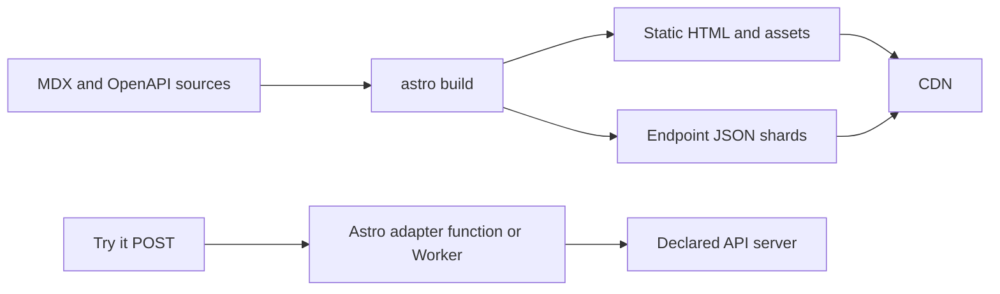

# Static-first deployment with Astro

The Astro template treats documentation as a release artefact. MDX pages,
OpenAPI navigation, endpoint payloads, Markdown mirrors, and discovery files
are produced during `astro build` and can be served from a CDN. A deployed
server exists only for the optional **Try it** proxy; it is not involved in
reading or rendering documentation content.



## Why this model

Documentation changes are published through a build and deployment. Rendering
the same MDX and OpenAPI model again for every reader would add latency and
runtime cost without making the documentation fresher. Static output instead
provides predictable cacheability, low time to first byte, and resilience when
the application runtime is unavailable.

The template configures Astro with `output: "static"`. Its catch-all
documentation and Markdown routes export `getStaticPaths()`, using the
build-generated MDX page list and OpenAPI endpoint index. Every known path is
therefore emitted during the build, including generated API-reference pages.

## OpenAPI data delivery

The browser receives a compact endpoint index for sidebar navigation and
search. Detailed content is split into static JSON files below:

```text
/_heyo-docs/openapi/<group>/<tag>/<operation>.json
```

For each prerendered API route, Astro also serialises that route’s detailed
payload into the static island input. The server-rendered HTML and the hydrated
React component therefore begin with the same complete endpoint data: opening
an API page does not first show a compact version and then replace it with a
richer UI. There is no endpoint-detail request or layout shift on the initial
page load.

The JSON shard remains a public, cacheable static artefact for integrations and
future prefetching. Each payload contains the endpoint’s request, response,
examples, security metadata, and only the component schemas reachable from that
endpoint. It intentionally does not duplicate the complete OpenAPI document in
the shared browser bundle.

## The one dynamic route

`POST /heyo-docs-internal/openapi-request` remains on demand and is marked with
`export const prerender = false`. It is used only when a reader selects **Send
request**. The handler validates that the selected server is declared by the
OpenAPI document, then performs the request server-side. This avoids browser
CORS limitations and keeps the documentation site from becoming an unrestricted
open proxy.

Astro still needs a deployment adapter for this route. The generated project
uses the Node adapter by default; the Cloudflare and Vercel deployment overlays
replace it with their respective adapter. Static pages and endpoint JSON remain
cacheable assets on all three targets.

## Operational implications

- Editing MDX or an OpenAPI schema requires a build and redeploy.
- Remote schemas are fetched during the build, so pin their URL or commit for
  reproducible releases.
- Build time and output size grow with the number of generated API routes.
  This is deliberate: every route is available as static content immediately
  after deployment.
- The `Try it` proxy can be removed if interactive requests are not required;
  the rest of the documentation remains fully static.

## What is not dynamic

Theme selection, local search, sidebar navigation, and endpoint rendering are
browser interactions backed by static page data and assets. They do not require
Astro SSR. The adapter function is reserved for actions that genuinely need a
server: currently the optional API request proxy.
