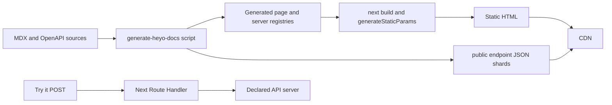

# Static-first deployment with Next.js

The Next.js template uses the App Router to statically generate every known
documentation and OpenAPI page. It retains a runtime for the optional **Try
it** proxy and the existing Markdown/discovery route handlers. This is not a
pure `output: "export"` application: the reader-facing HTML pages and OpenAPI
data are static and CDN-cacheable, while a small set of auxiliary actions can
still run on demand.



## Build pipeline

Before development and production builds, `scripts/generate-heyo-docs.ts` runs
`generateNextContent()`. It scans MDX, parses OpenAPI documents, validates the
navigation model, and writes generated modules beneath `app/_heyo-docs`.

The catch-all documentation page exports `generateStaticParams()` from that
model and is configured with `dynamic = "force-static"`. Every known MDX and
OpenAPI URL is rendered during `next build`; no request-time OpenAPI lookup is
needed for a reader to reach a page or receive its metadata.

## Static endpoint payloads

The generated client module holds a compact endpoint index. Detailed endpoint
information is emitted under `public/_heyo-docs/openapi` and is served as static
JSON:

```text
/_heyo-docs/openapi/<group>/<tag>/<operation>.json
```

While rendering each static API page, the Server Component passes that route’s
endpoint payload to the interactive documentation component. The generated HTML
and React hydration start with the same complete data, so an API page does not
render a compact shell and then visibly change when detail data arrives.

The JSON remains a public build artefact, served by the CDN rather than a Route
Handler, for integrations and as a static fallback when an integration starts
from the compact index alone. Endpoint payloads retain only the component
schemas reachable from that operation, which prevents a large OpenAPI document
from appearing in the shared JavaScript bundle.

## Dynamic boundary: API requests

`POST /heyo-docs-internal/openapi-request` remains a Next Route Handler. It is
used exclusively by the **Send request** button and forwards a request to a
server declared by the OpenAPI document. The route is dynamic because it
executes an action, not because documentation data is dynamic.

Do not switch this project to `output: "export"` while the proxy is enabled:
static export has no runtime server for POST handling. On Vercel the handler is
served by the platform runtime; on Cloudflare the OpenNext deployment provides
the Worker runtime. Static pages and assets remain independently cacheable.

The Markdown mirror and discovery route handlers retain their current
on-demand behaviour so an installation without `siteUrl` can derive absolute
URLs from its deployment origin. They are not involved in rendering
documentation pages or loading endpoint data. Set `siteUrl` before deployment
to make generated canonical and discovery URLs deterministic.

## Operational model

- Content and OpenAPI changes are published by running the generator, building,
  and deploying.
- Pin remote schema URLs when reproducibility matters.
- Large APIs increase build output and build time instead of user-facing SSR
  latency.
- Remove the proxy route if the site does not offer interactive API calls; the
  documentation HTML and endpoint details continue to work as static content.
