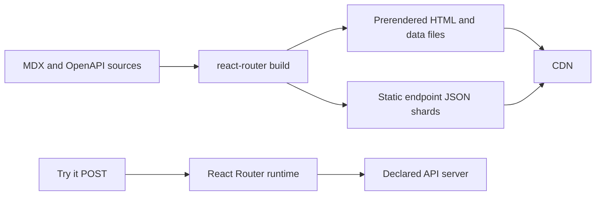

# Static-first deployment with React Router

The React Router template prerenders every known documentation route at build
time while retaining a minimal runtime server for the optional **Try it** API
proxy. The result is a hybrid deployment: documentation is served as static
HTML and assets from the CDN, but an intentional POST action can still execute
securely on the server.



## Rendering strategy

`react-router.config.ts` keeps `ssr: true` so a runtime action route is
available, then uses the `prerender` option to enumerate all MDX and generated
OpenAPI paths. It also prerenders `robots.txt`, `sitemap.xml`, RSS, and LLMS
files. The existing `*.md` mirror is served by its resource route when needed;
it is intentionally outside the documentation HTML prerender list.

The route list comes from `documentationPaths()` in `@heyo-sh/heyo-docs/node`. It scans
the configured content directory, loads the configured OpenAPI documents,
applies the same collision rules as the application, and returns the final
public slugs. The build is therefore the single source of truth for both the
sidebar and static deployment output.

Unlisted application routes may still use normal SSR. Heyo Docs itself does not
depend on that fallback for documentation pages.

## OpenAPI data delivery

The client bundle contains only the compact endpoint index needed for
navigation and search. Rich endpoint data is emitted as a static JSON asset:

```text
/_heyo-docs/openapi/<group>/<tag>/<operation>.json
```

During prerendering, the route loader resolves the active endpoint and
serialises its detailed payload with that route’s static data. The initial HTML
and hydration therefore render the final API-reference UI immediately; there
is no compact-first render followed by a visible replacement.

For client-side navigation, the loader waits for the same-origin JSON shard
from the CDN before React Router commits the destination route. This preserves
the same visual guarantee when moving between endpoint pages. The JSON includes
endpoint-specific schemas, examples, parameters, responses, and security
information, but only the OpenAPI components reachable from that operation. It
avoids shipping the complete schema in the shared browser bundle.

## Dynamic boundary: Try it

`POST /heyo-docs-internal/openapi-request` is deliberately not prerendered. It
is the only runtime route involved in OpenAPI: it forwards a documented request
to an API server selected from the schema. Keeping that work server-side avoids
browser CORS constraints and lets the handler reject unknown target servers.

The existing Markdown mirror resource route can also run on demand. It is
separate from HTML documentation rendering and from the static OpenAPI JSON
assets.

Cloudflare and Vercel overlays host this route in their respective runtime;
the static pages and JSON assets are still delivered by the platform CDN. If
interactive requests are unnecessary, the route can be removed without
affecting the generated documentation.

## Release and scale characteristics

- A documentation or schema change takes effect after build and deploy.
- Remote OpenAPI sources are build dependencies; use pinned URLs for
  repeatable releases.
- More endpoints increase build time and static output size, not request-time
  compute.
- The CDN can cache pages and endpoint JSON independently, so a reader only
  downloads detailed data for the API operation they view.
